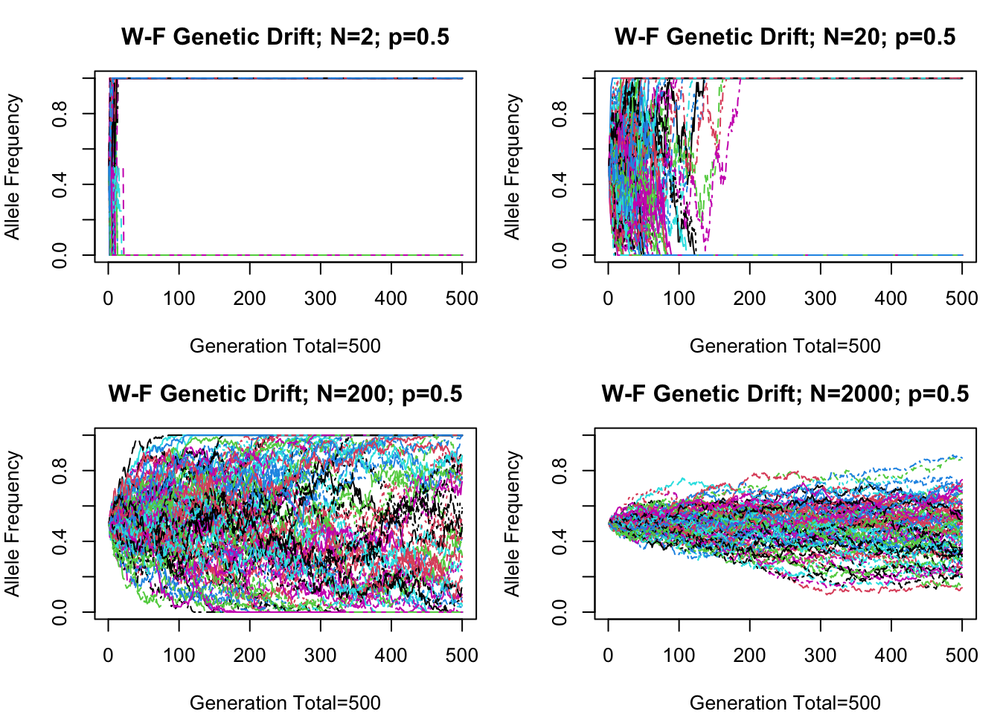
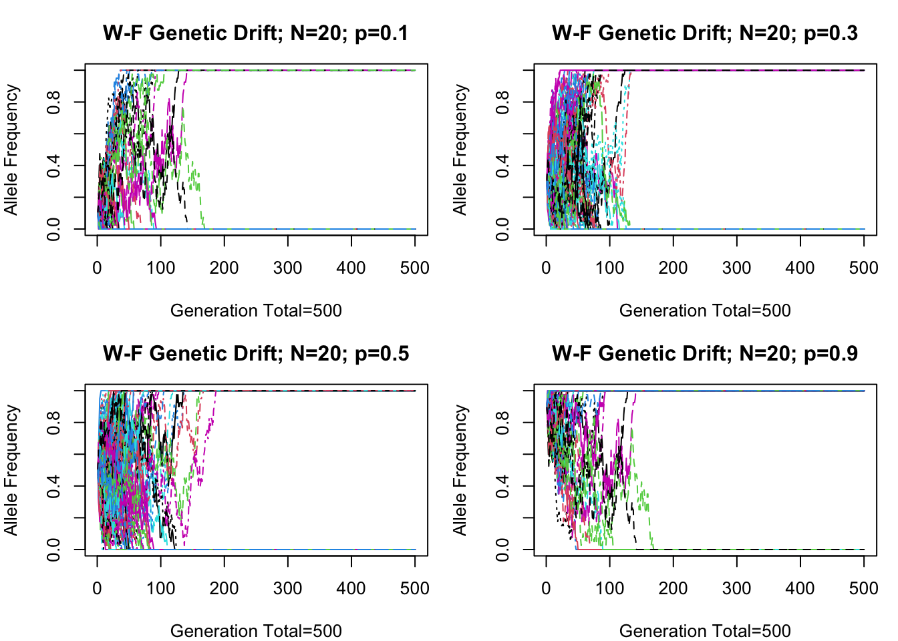
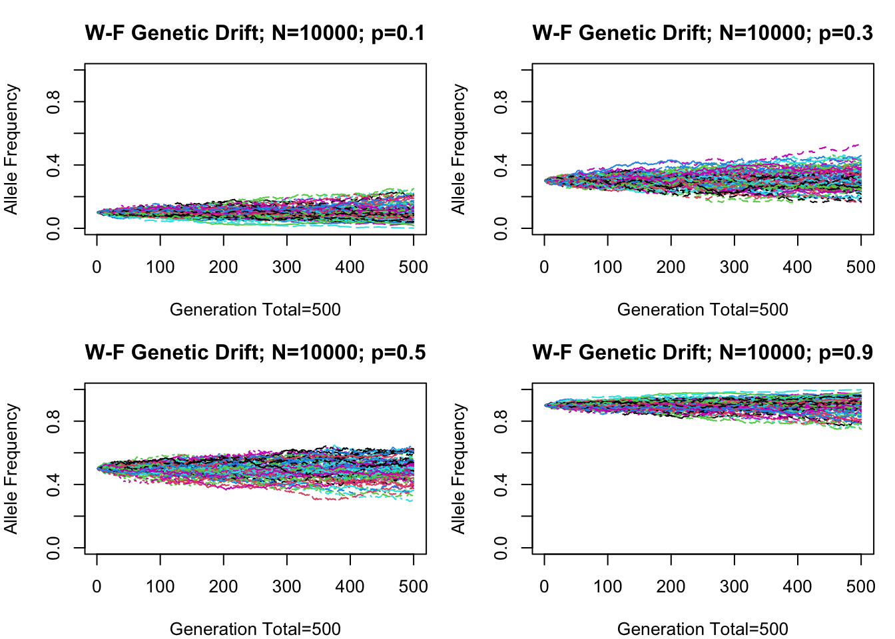
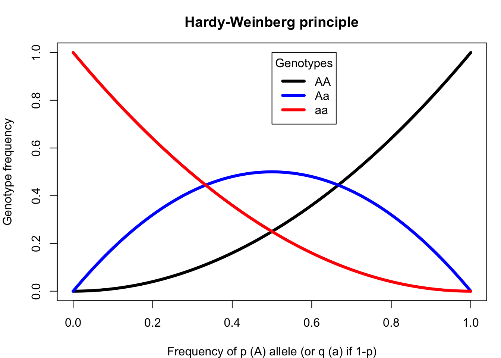

# Simulating the Wright-Fisher model in R and Hardy-Weinberg principle of genotype frequencies

This repository shows how to simulation of the Wright–Fisher Model (genetic drift) and plot the Hardy-Weinberg principle.

The main contributor to this repository is Marc-Olivier Beausoleil (McGill University). 

## Structure of the project

### OSF 

This project is [hosted on OSF](https://osf.io/mvc8a/). 

### Github

If the folder structure is not created, you should run the `0.initialize.R` script which will install and load all libraries, create the folder structure.

### Scripts 

 - `scripts/0.initialize.R`: This script is used to load the libraries, and create the folder structure if it is not present. 
 - `scripts/1.session.info.R`: This script is used print the session information. 
 - `scripts/WF_genetic_drift_simulation.R`: Contains the WF-model simulation function and the Hardy-Weinberg principle function 

### Report 

 - `report/WF_model_simulation_report.Rmd`: is a markdown report containing the simulations and explaining the results 
 - `report/styles/evolution.csl`: the `.csl` is the "Citation Style Language" used to cite references in the report. 
 - `report/references/wf_model_simul.bib`: This `.bib` contains the references which are cited in the report. 
 
### Data

 - `data/WF_model`: Each sub-folder in this directory star with `sim.` followed by the variable that was changed in the simulation (`n` for the number of individual or `p` for the starting allele frequency, for example, the folder `sim.n`, means that the data in this folder was simulated and each file had only its number of individual changed). The `.csv` files in these folder are named `wf.simulation.` and appended with the relevant modification for the simulation (`n.X` means `X` individuals per population, `p.Y` means the frequency of `p` given by `Y` [between 0 and 1]). 
 - `data/HW_principle`: There is only one graph to be generated so there is only one `hw_simulation.csv` file output from a sequence of allele frequencies `p` passed through the function `h.p.2pq.q`. 
 
 ### Output 
 
 - `output/session_info/session_information.txt`: Contains information about the session info for R (version of packages and `R`)

#### Wright-Fisher simulation





#### Hardy-Weinberg principle 


 
### Licence

 - `LICENSE`: GNU GENERAL PUBLIC LICENSE Version 2
 
### Summary of file structure

 ```
  ├── data
  │   ├── HW_principle
  │   └── WF_model
  ├── output
  │   └── session_info
  ├── report
  │   ├── references
  │   ├── styles
  │   ├── [...]
  │   └── WF_model_simulation_report.Rmd
  ├── scripts 
  │   ├── 0.1initialize.R
  │   ├── 1.session.info.R
  │   └── WF_genetic_drift_simulation.R
  ├── LICENSE
  ├── README.md
  └── simulationWF.Rproj
  [...] Miscellaneous files
```